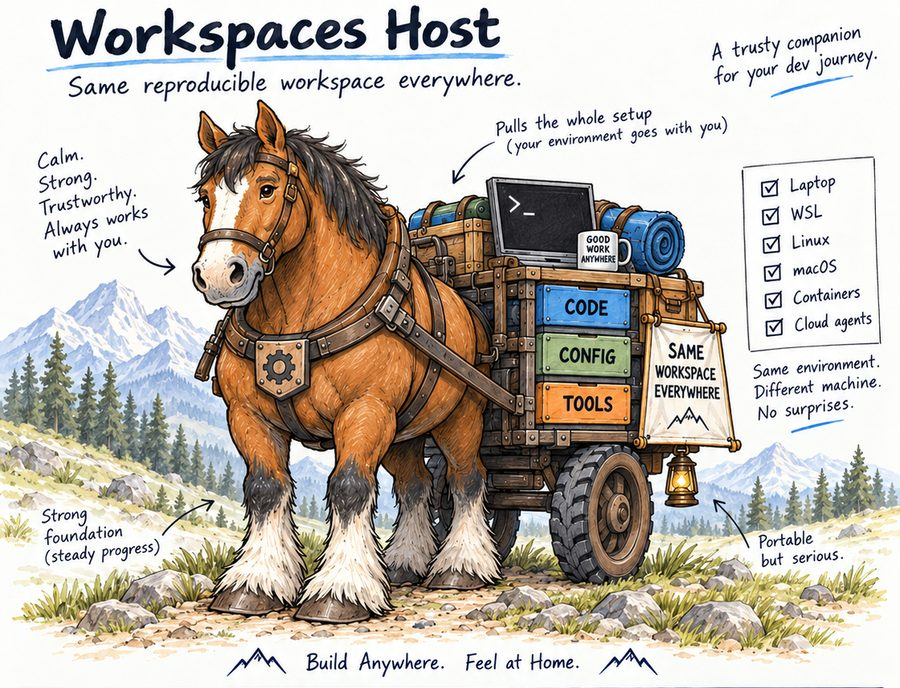

# workspaces-host

`ws-host` sets up your machine for Intellectual Frontiers work, copies your repositories and keeps them current without touching your
changes, installs the tools each kind of work needs, and gives VS Code a window onto all of it.

**Read the guide: <https://intellectual-frontiers.github.io/workspaces-host/>**

## The flow

For Windows 11 with Debian from the Microsoft Store (WSL). The guide has every step in detail, with what you will see and what to do if
something stops you.

1. **Get Debian.** Install *Debian* from the Microsoft Store and open it.
2. **Install.** In the Debian window run `cd && sudo apt update && sudo apt install -y curl wget`, then
   `curl -fsSL https://raw.githubusercontent.com/intellectual-frontiers/workspaces-host/main/install.sh | sh`. The installer does the
   bootstrapping.
3. **Sign in to GitHub.** Run `ws-host auth new github`, type the code into your browser, then run `ws-host workspace advance` again.
4. **Open VS Code.** Install VS Code on Windows, run `code .` from a repository in the Debian window, then `ws-host vscode advance`.
5. **Learn.** In VS Code press `Ctrl+Shift+P` and run *Workspace: Learn*. Everything you do every day is taught there, one button at a
   time. In a terminal the same pages are `ws-host help`.

## For contributors

Everything is Python, found by presence: a module in `ws_host/commands/`, `ws_host/kits/` or `ws_host/help/` adds a command, a kit or a help
topic. `ws-host test`, `check`, `doctor` and `fresh` say whether a change is sound. The guide's reference is generated from the code by
`ws-host docs generate`. See *Extend it with AI* in the guide, and `.claude/skills/ws-host/SKILL.md` for an AI to read first.

MIT licence.
