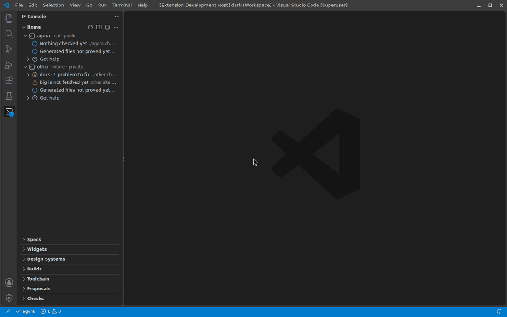
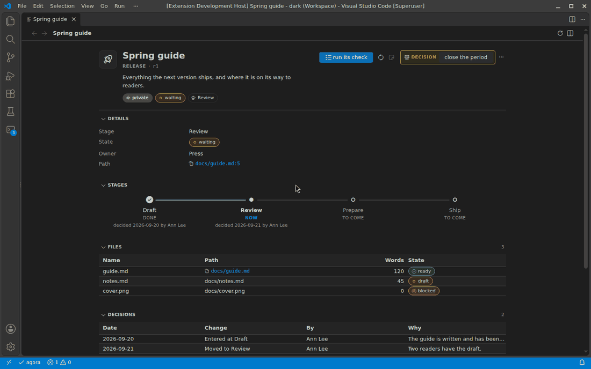
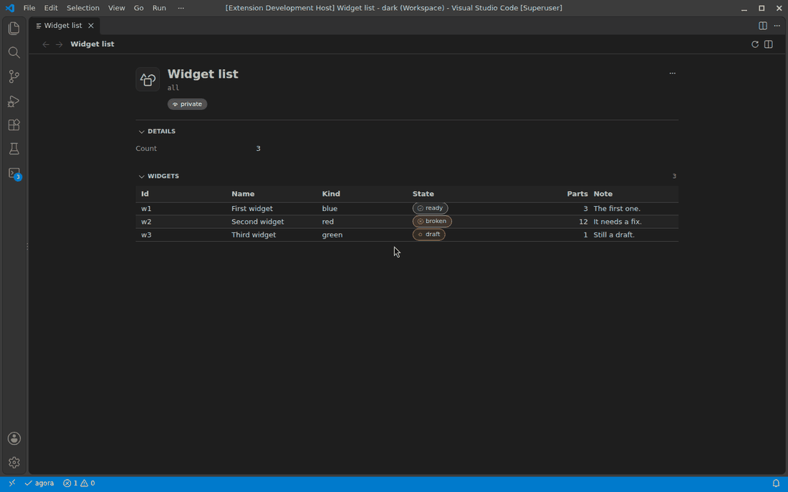
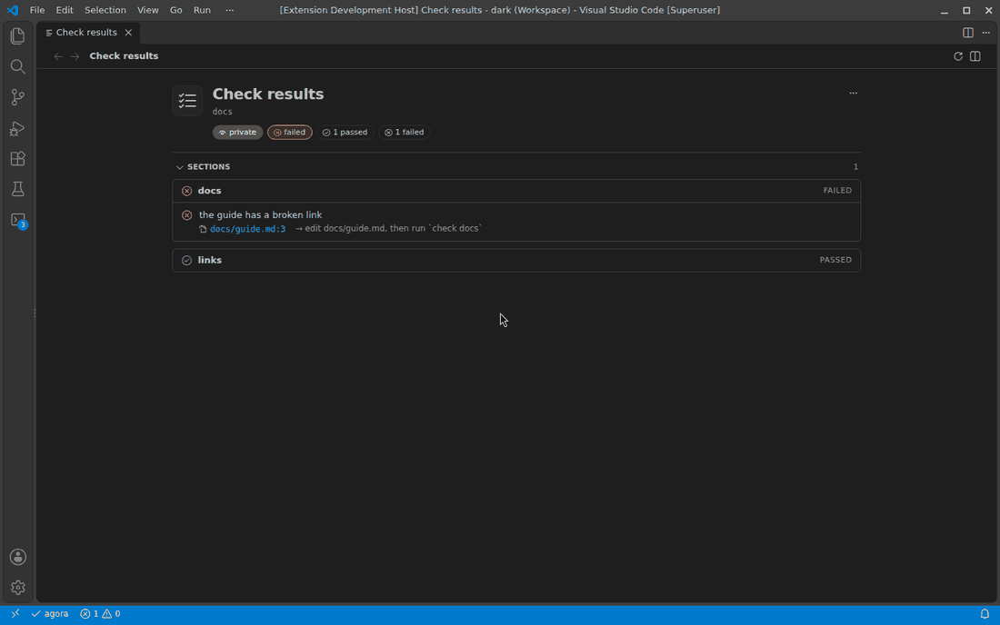
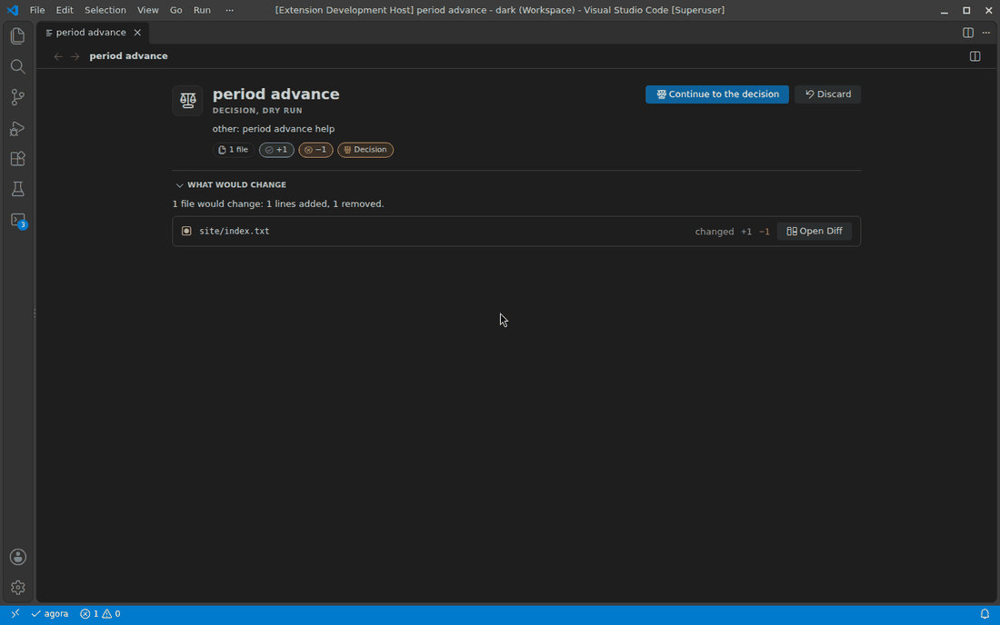
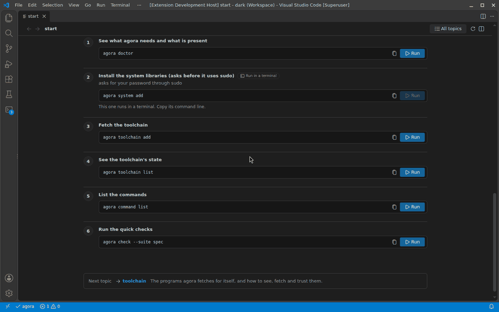
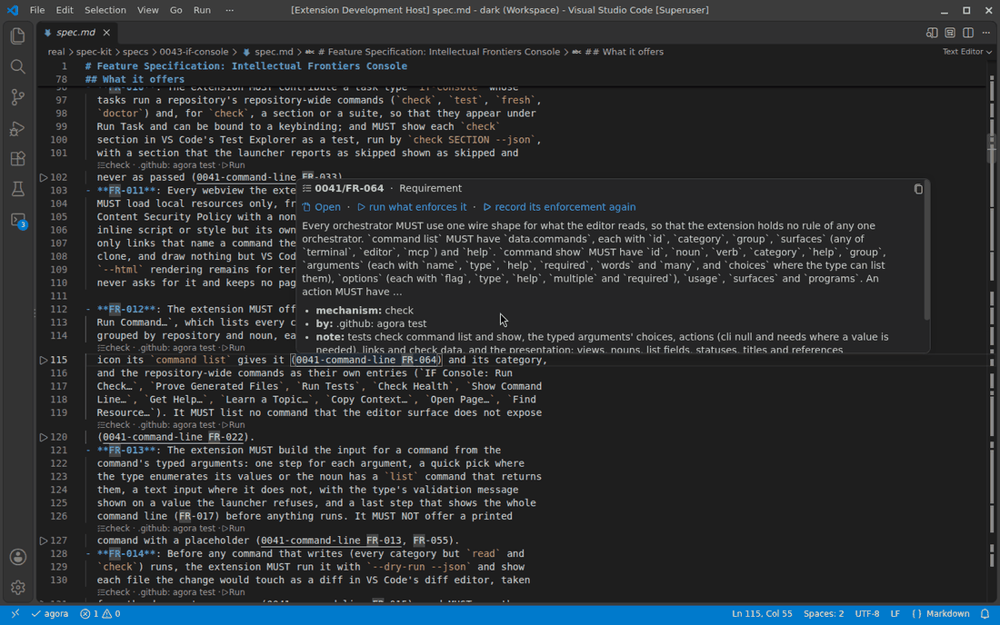

# Workspaces Console

Workspaces Console is VS Code's window onto a repository's own command line. It finds each trusted repository's launcher by a one-line declaration
(`.workspaces-host/provider.toml`), asks it what it can do, and offers that the way VS Code offers anything: a **Home** view that says what needs you, the
views the command line itself declares, checks as tests, findings in Problems, a panel for each resource, forms built from each command's typed
arguments, a diff of what a write would change before it is made, and a modal only you can answer for a decision. The command line is the core
interface; the extension adds nothing a command does not do, runs nothing in a workspace you have not trusted, opens no network connection
and collects no telemetry.

## What needs you

**Home** lists what needs a person across every command line in the window: a failing check, an open proposal, a generated file out of date, a
program the toolchain has not fetched. Each says what is wrong in plain words, shows the exact command line that fixes it (to copy and paste in a
terminal) and has a **Run** button that goes through the same dry-run and confirmation path as everything else. Where no command does it, it
says what you must do yourself. Its count is the view's badge and the status bar's; a click on the status bar opens Home with the first
suggestion in view.

## One panel for every resource

A click on a row opens its resource in **one panel** (a second one is never opened: the panel is revealed), with back and forward, a
breadcrumb and *Open to the Side*. It is drawn from the resource's JSON by what the data is:

- a **header** with the kind's codicon, the title, the kind and id, an audience pill and status pills in VS Code's own status colors;
- an **action toolbar**: the primary action as a button, the others as icon buttons with tooltips, *Copy as JSON* and *Copy Context* in the
  overflow menu, and a **decision** styled apart, which still goes through the dry run and the modal; an action that cannot run now says why;
- **sections** by the data's shape: a key-value grid, a sortable and filterable table whose rows open in the panel, a stepper for stages,
  findings that open at their file and line, paragraphs, and link chips.

## Writes are shown before they are made

A command that writes is run with `--dry-run` first. The panel shows what it would change, each file as a diff in VS Code's diff editor, and
nothing is written until you apply it. A decision then asks you in a modal that names the command, the resource and what it changes.

## Learn

**Workspaces Console: Learn a Topic** lists the help topics the command line has, and a topic opens in the same panel as numbered steps, each with the
exact command line to copy and a **Run** button; a step that runs in a terminal says so, and a step you must do yourself is marked as yours.

## Native surfaces first

Checks are tests in the **Test Explorer**; findings are in **Problems** and as file decorations; hovers, Go to Definition, CodeLens and links
work in the files a command line's references name; tasks run the repository-wide commands; the output channel keeps every command line run.
All of it is light, dark and high-contrast.

## Requirements and settings

- VS Code 1.101 or later, in a trusted workspace (the extension declares it does not support restricted mode), on a machine where the
  repository's launcher runs. A repository needs only Python and uv.
- `workspaces-console.launchers` (your own user settings only, never a workspace's), `workspaces-console.checkOnSave`, `workspaces-console.showAllCommands` and
  `workspaces-console.rowLimit`.

## What it will not do

It never runs a decision without a modal that only you can answer, never lists a decision in the MCP servers it registers, exports no API to
other extensions, makes no network connection and sends no telemetry. The command lines it runs are written to the **Workspaces Console** output channel
so that you can paste any of them in a terminal.

The extension is built and tested with the repository's own command line (its `extension build` and `check extension`); there is nothing to
install but the `.vsix` it writes.
